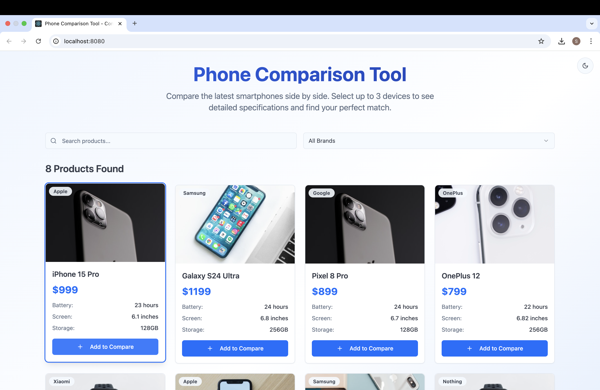
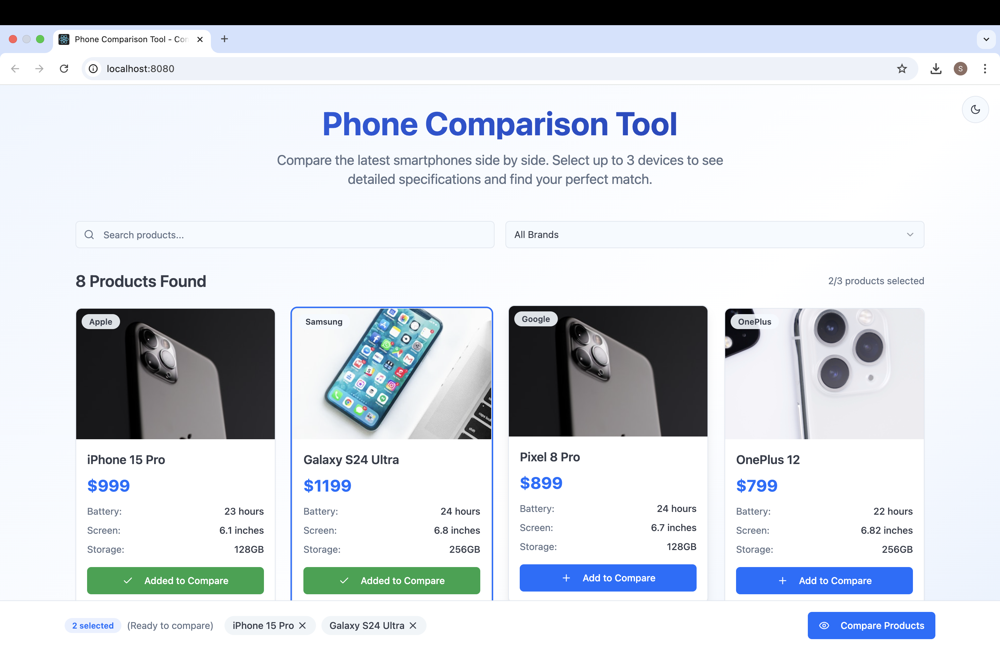
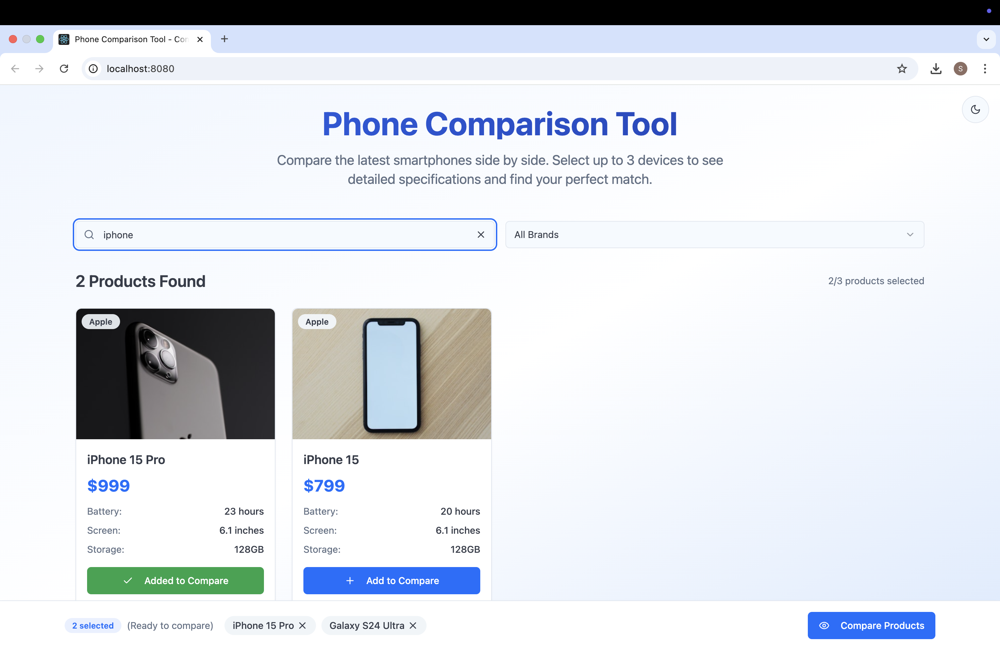
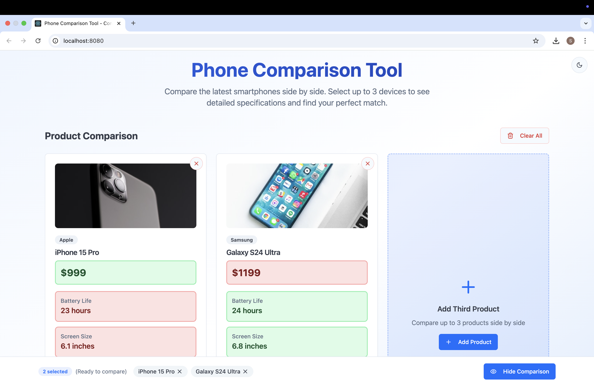

# Phone Comparison Tool

## Project Info

A modern React app for comparing smartphones side by side. Built with Vite, TypeScript, Tailwind CSS, and shadcn-ui components.

---

## Setup Instructions

1. **Clone the repository:**
   ```sh
   git clone <YOUR_GIT_URL>
   cd <YOUR_PROJECT_NAME>
   ```
2. **Install dependencies:**
   ```sh
   npm install
   ```
3. **Start the development server:**
   ```sh
   npm run dev
   ```
4. **Open your browser:**
   - Visit [http://localhost:8080](http://localhost:8080) (or the port shown in your terminal).

---

## Features

- **Smartphone Comparison:**
  - Select multiple phones to compare their features side by side.
- **Search & Filter:**
  - Quickly find phones by name or filter by brand/specs.
- **Responsive Design:**
  - Works well on both desktop and mobile devices.
- **Theme Toggle:**
  - Switch between light and dark mode.
- **Modern UI:**
  - Built with shadcn-ui and Tailwind CSS for a clean, accessible interface.
- **Persistent Comparison Bar:**
  - Selected phones remain visible for easy access.

---

## Assumptions

- The product data is static and loaded from a local file (`src/data/products.ts`).
- No backend or API integration is present; all data is handled client-side.
- The UI components in `src/components/ui/` are based on shadcn-ui and only the ones used in the app are included.
- The app is intended as a demo or assessment project and is not production-hardened.

---

## Technologies Used

- [Vite](https://vitejs.dev/)
- [React](https://react.dev/)
- [TypeScript](https://www.typescriptlang.org/)
- [Tailwind CSS](https://tailwindcss.com/)
- [shadcn-ui](https://ui.shadcn.com/)

---

## Deployment

You can deploy this project using any static hosting provider that supports Vite builds (e.g., Vercel, Netlify, GitHub Pages):

1. **Build the project:**
   ```sh
   npm run build
   ```
2. **Preview the production build locally:**
   ```sh
   npm run preview
   ```
3. **Deploy the contents of the `dist/` folder to your chosen host.**

## Preview








## Live Demo

👉 [View the live app here](https://shivanisshekhawat.github.io/addteq-shivani/index.html)

> This project was built as part of a frontend assessment to demonstrate component architecture, clean UI, and React TypeScript proficiency.
